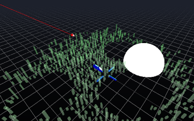

ChanibaL's js13k/2021 entry for WebXR category
==============================================

Your city is bombarded from orbit.

You control an defence platform, your task is to ensure survival of at least 25% of population for as long as possible.

How to play
-----------

This game requires a VR headset and two hand controllers.

To shoot use the main trigger. 
To move use the grab button and move your controller.
To zoom in and out use the grab button on both controllers and pinch them closer or further from each other.

Click anywhere to start VR.

Libraries, asset sources
------------------------

- [THREE.js](https://threejs.org/) rev. 132-dev (js13k requirement) and 131 (for debug)
- [js13k-ecs](https://github.com/kutuluk/js13k-ecs)
- [ZzFX - Zuper Zmall Zound Zynth](https://github.com/KilledByAPixel/ZzFX) (modified)
- ZzFX generated sounds

License
-------

[MIT](LICENSE.md)

